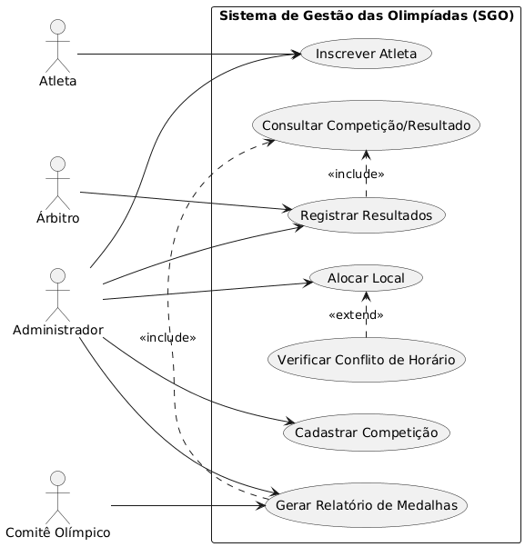
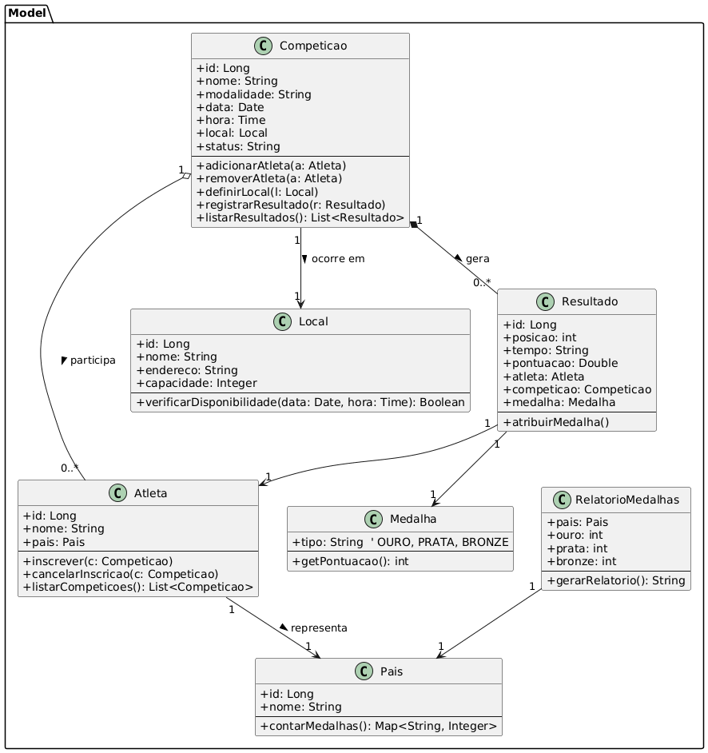
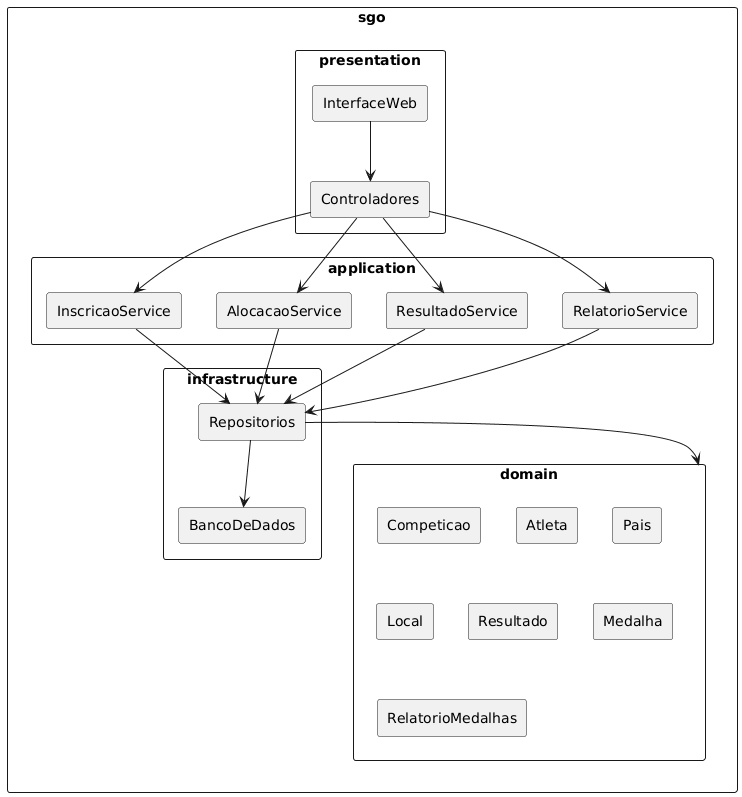
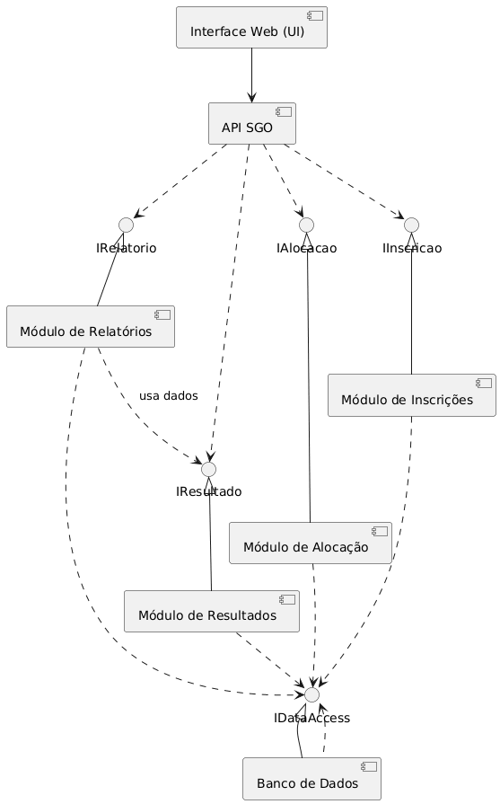
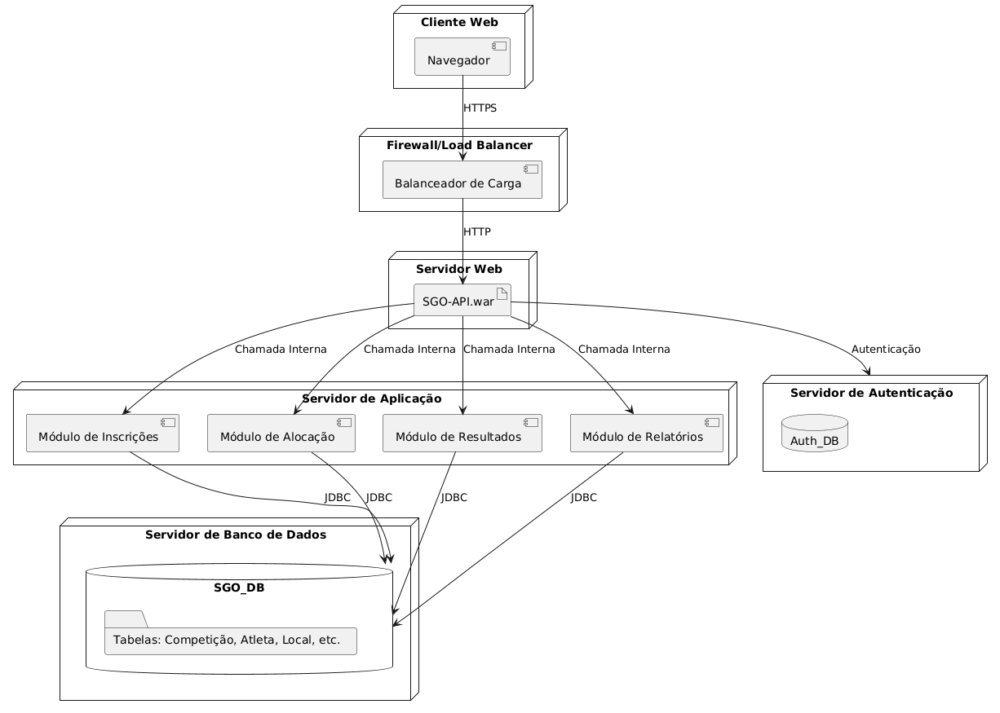

# Sistema de Gestão das Olimpíadas (SGO)

## Introdução
O **Sistema de Gestão das Olimpíadas (SGO)** é uma solução completa para gerenciamento de competições olímpicas, incluindo cadastro de competições, inscrições de atletas, alocação de locais, registro de resultados e geração de relatórios de medalhas por país.

Este repositório contém a **modelagem UML completa** do sistema, desenvolvida como parte da disciplina de Projeto de Software.

---

## Requisitos e Regras de Negócio

### 1. Cadastro de Competições
- **Descrição**: Registrar competições com nome, modalidade, data, horário, local e lista de atletas inscritos
- **Regras**: Cada competição deve ter dados completos e únicos

### 2. Inscrição de Atletas
- **Descrição**: Permitir inscrição de atletas de diferentes países em competições específicas
- **Regras**: 
  - Atleta pode participar de múltiplas competições
  - Representa apenas um país por modalidade
  - Não pode haver inscrições duplicadas

### 3. Alocação de Locais
- **Descrição**: Alocar locais físicos para as competições
- **Regras**: 
  - Evitar conflitos de horário
  - Um local só pode hospedar uma competição por vez
  - Verificação automática de disponibilidade

### 4. Controle de Resultados
- **Descrição**: Registrar resultados finais das competições
- **Regras**: 
  - Definir 1º, 2º e 3º lugares
  - Atribuir medalhas automaticamente
  - Histórico imutável após confirmação

### 5. Relatórios de Medalhas
- **Descrição**: Gerar relatórios de desempenho por país
- **Regras**: 
  - Contagem de ouro, prata e bronze
  - Ranking por total de medalhas
  - Filtros por data e modalidade

---

## Histórias de Usuário

### US01 - Cadastrar Competição
**Como** Administrador do Sistema  
**Quero** cadastrar uma nova competição com todos os dados necessários  
**Para** que ela esteja disponível para inscrições de atletas

**Critérios de Aceitação:**
- Deve incluir nome, modalidade, data, horário e local
- Não pode haver competições duplicadas
- Data deve ser futura

### US02 - Inscrever Atleta em Competição
**Como** Administrador ou Atleta  
**Quero** inscrever um atleta em uma competição específica  
**Para** permitir sua participação no evento

**Critérios de Aceitação:**
- Atleta deve estar vinculado a um país
- Não pode estar inscrito na mesma competição duas vezes
- Deve respeitar o prazo de inscrição

### US03 - Alocar Local para Competição
**Como** Administrador de Locais  
**Quero** alocar um local para uma competição  
**Para** garantir infraestrutura adequada para o evento

**Critérios de Aceitação:**
- Local deve estar disponível no horário desejado
- Capacidade do local deve suportar a competição
- Não pode haver sobreposição com outras competições

### US04 - Registrar Resultados da Competição
**Como** Árbitro Oficial  
**Quero** registrar os resultados finais de uma competição  
**Para** oficializar os vencedores e atualizar o ranking

**Critérios de Aceitação:**
- Deve definir 1º, 2º e 3º lugares
- Resultados devem ser confirmados por dois árbitros
- Medalhas são atribuídas automaticamente

### US05 - Gerar Relatório de Medalhas
**Como** Comitê Organizador  
**Quero** visualizar relatório de medalhas por país  
**Para** analisar o desempenho das delegações

**Critérios de Aceitação:**
- Mostrar contagem de ouro, prata e bronze
- Ordenar por total de medalhas
- Permitir filtro por período e modalidade

---

## Diagramas do Sistema

### Diagrama de Caso de Uso

*Mostra as interações entre atores (Administrador, Atleta, Árbitro) e as funcionalidades principais do sistema.*

### Diagrama de Classes

*Modela as entidades principais do domínio: Competição, Atleta, Local, País, Resultado, Medalha e suas relações.*

### Diagrama de Pacotes

*Organiza o sistema em pacotes lógicos: `apresentacao`, `negocio`, `dados`, `util`.*

### Diagrama de Componentes

*Ilustra os componentes principais e suas dependências: Interface Web, Módulos de Negócio, Persistência.*

### Diagrama de Implantação

*Apresenta a arquitetura de implantação com clientes web, servidores de aplicação e banco de dados.*

---

## Como Visualizar os Diagramas

### Opção 1: Visual Studio Code (Recomendado)
1. Instale a extensão **PlantUML** no VSCode
2. Clone este repositório
3. Abra os arquivos `.puml` na pasta `modelagens/`
4. Use `Alt + D` para visualizar o diagrama

### Opção 2: Site Oficial PlantUML
1. Acesse [plantuml.com](https://plantuml.com/)
2. Copie o conteúdo do arquivo `.puml`
3. Cole no editor online
4. Visualize o diagrama gerado

### Opção 3: Draw.io
1. Abra [draw.io](https://app.diagrams.net/)
2. Importe os arquivos `.puml` ou `.xml`
3. Edite e exporte como PNG

---

## Responsáveis

**Aluno:** Gustavo Alvarenga Ribeiro Carvalho  
**Professor:** João Paulo Carneiro Aramuni  
**Instituição:** PUC Minas - Engenharia de Software  
**Período:** 4º - Turno: Noite

---

## Observações Finais

- Todos os diagramas foram desenvolvidos seguindo as convenções UML 2.0
- A modelagem considera os requisitos especificados no trabalho
- Os nomes de classes, atributos e métodos estão em português para manter coerência com o domínio
- Esta modelagem serve como base para implementação futura do sistema